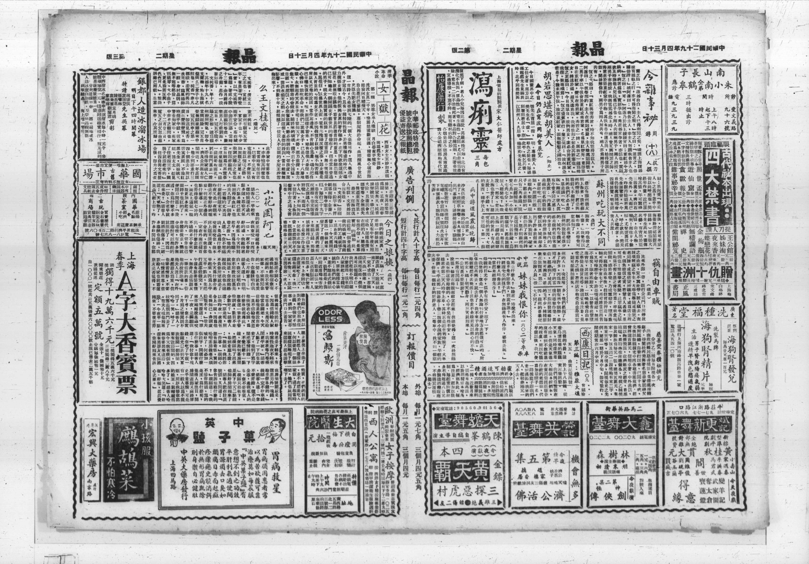
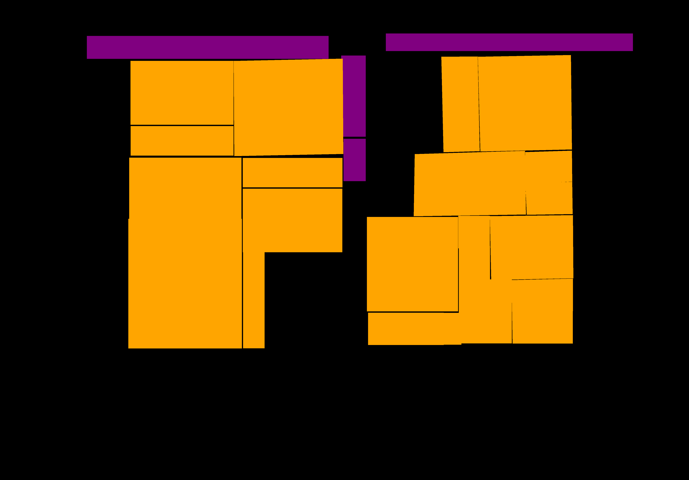

# ECPO Segmentation

## Installation

First, make sure that you have Python 3.5 or newer. Then install `dhSegment` by
following their [installation
procedure](https://github.com/dhlab-epfl/dhSegment)

Then install `ecpo_segment` by executing `pip install .` in this repository’s
root.

## Running Tests

The tests can be run via `pytest tests` or `python setup.py pytest`.

## Getting Annotations from ECPO API

First, you have to retrieve annotations from the ECPO API and save
them as PNG files that serve as masks. For each image (i.e. for each
scan), there will be a mask of the same dimensions that consists of
black backgroud and colored polygons. Their color indicates the
annotation.

Assuming the Jingbao images live in `Jingbao/images_renamed`, the
following command will retrieve the first 100 annotations the API
returns, discard all but the annotations with label `article` or
`additional` and will then save the masks in `Jingbao/masks`.

```
python3 get_annotations.py --restrict-to-label-names article,additional --max-annotations 100 Jingbao/images_renamed
```

Here is an example of an image and its constructed annotation mask:



