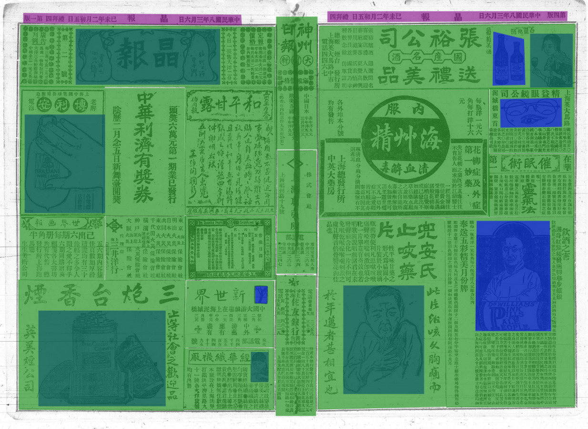
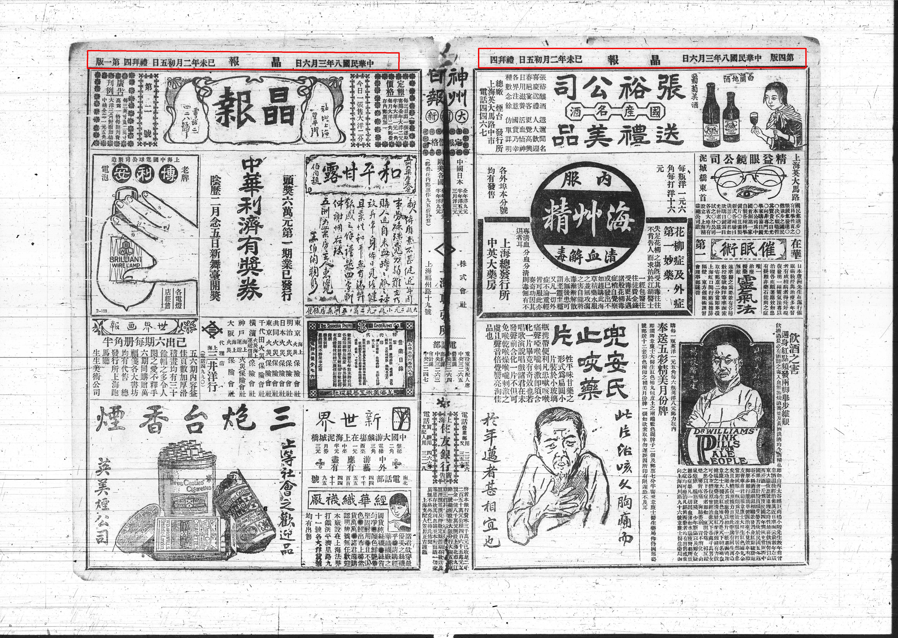
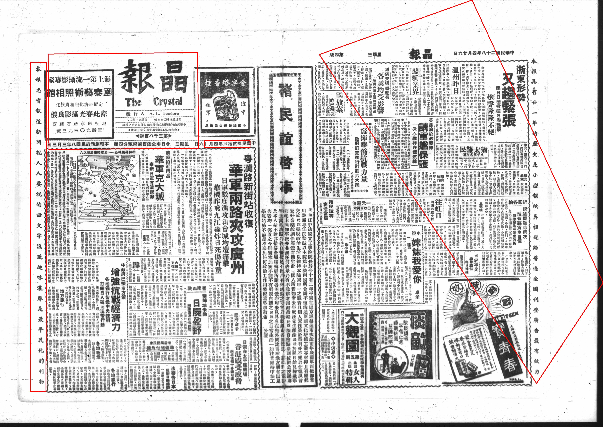

# Simple Additional Content Detection

This experiment focuses on recognizing the parts of a document labeled
“additional”, which primarily consists of headlines.

It was executed with ecpo-segment at commit
3c544f710d4ad4bdda31da0e9a23dcecd5c6544f and dhSegment at commit
543962fdb5339b4fbcc401f90ea1b6ef9a475497.


## Getting Annotation Masks

Only annotations of “additional” material were included in the masks.

```
python3 get_annotations.py --restrict-to-label-names additional --max-annotations 1000 Jingbao/images_renamed
```

The above command yielded 105 image masks, of which 70 were used to as
the training set, 15 as the validation set and 15 as the test
set. (See the subdirectory `splits` for a detailed list of which file
was in which set.) After cloning the
[https://github.com/dhlab-epfl/dhSegment](dhSegment repository), the
masks and their corresponding images were put into this repo’s
directories `dhSegment/demo/pages{train,val_a1,test_a1}` as described
in their documentation file `dhSegment/doc/start/demo.rst`.

## Training

After installing dhSegment and its dependencies, the ResNet model was
downloaded and fine-tuned with dhSegment’s `train.py` script. I.e., in
the dhSegment repo:

```
cd pretrained_models && python3 download_resnet_pretrained_model.py && cd ..
python3 train.py with demo/demo_config.json
```

After this step, there is a directory called `demo/page_model/export`
which holds the trained model.

## Qualitative Evaluation

The script `extract_annotations.py` was then used to run the model on
the 15 images in the test set. It runs the dhSegment neural net,
binarizes the output masks and finds boxes suiting the masks. Boxes
covering 0.05 % percent of the image or less are discarded.

```
python extract_annotations.py -m demo/page_model/export -o demo/processed_images -a 0.0005 --raw-out-dir demo/processed_images/raw/ demo/pages/test_a1/images/
```

Below, there are two example documents – one easy, one hard. For each
document, there is one image with the gold annotation, one with the
binarized neural net output and one with the boxes inferred from the
binarized output.

We can see that the simple case of just two headlines is handled
correctly. Some smaller annotations (e.g. a dot in the bottom left)
are discarded based on their size.

The second document reveals that the model has difficulty producing
sharply bounded smaller annotations that are near to each other
instead of merging them. Additionally, the bounding box drawing has to
be adjusted so as not to draw polygons diverging too far from a rectangle.









## Quantitative Evaluation

Mean IoU for class 0 (not-additional): 0.983
Mean IoU for class 1 (additional): 0.623

Mean of means: 0.803
