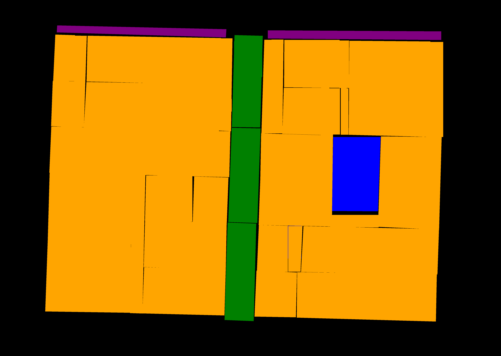
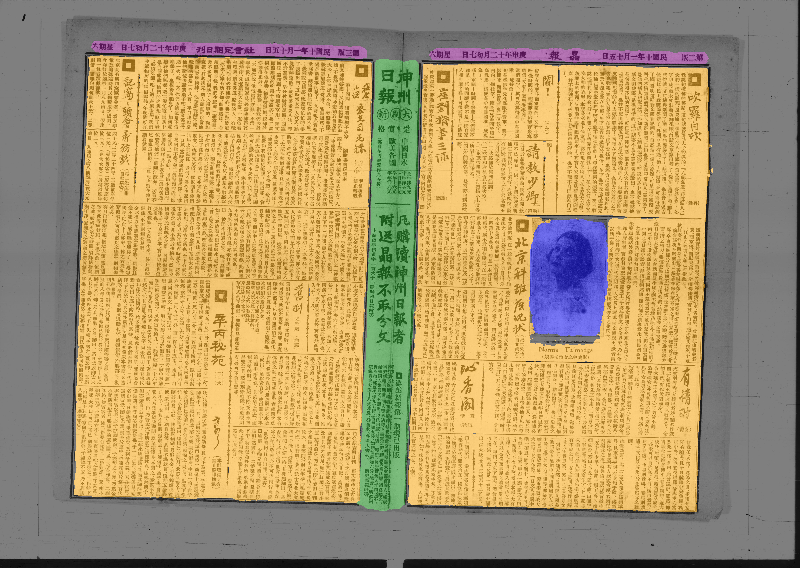
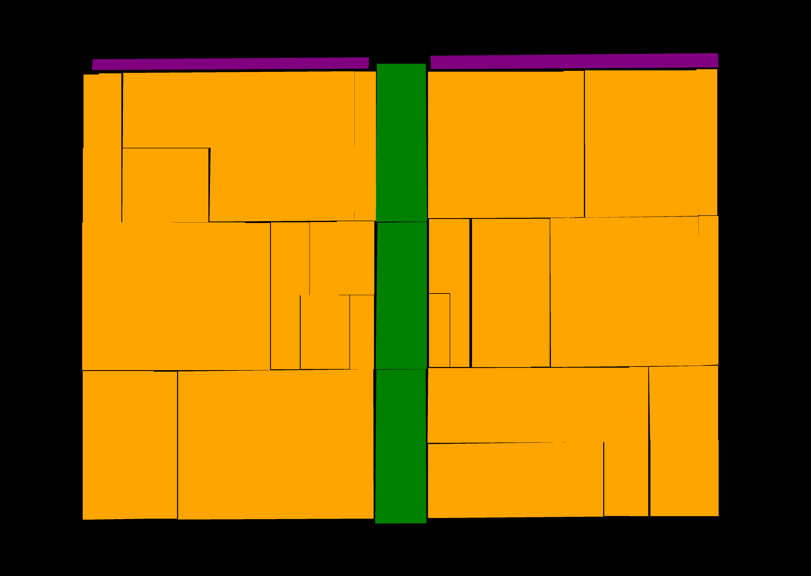
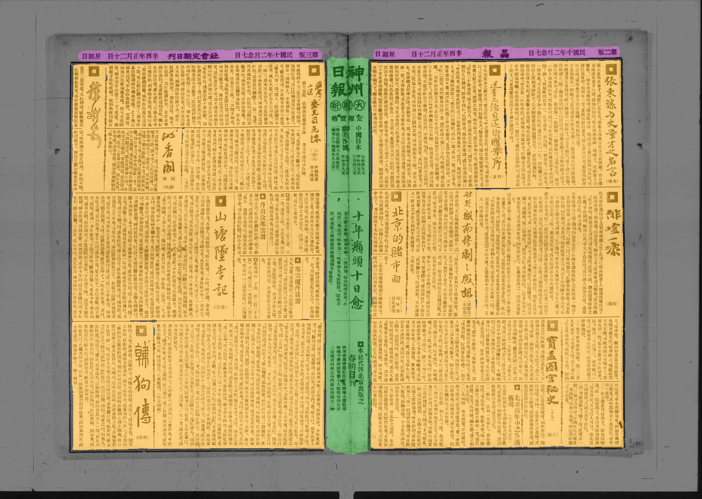
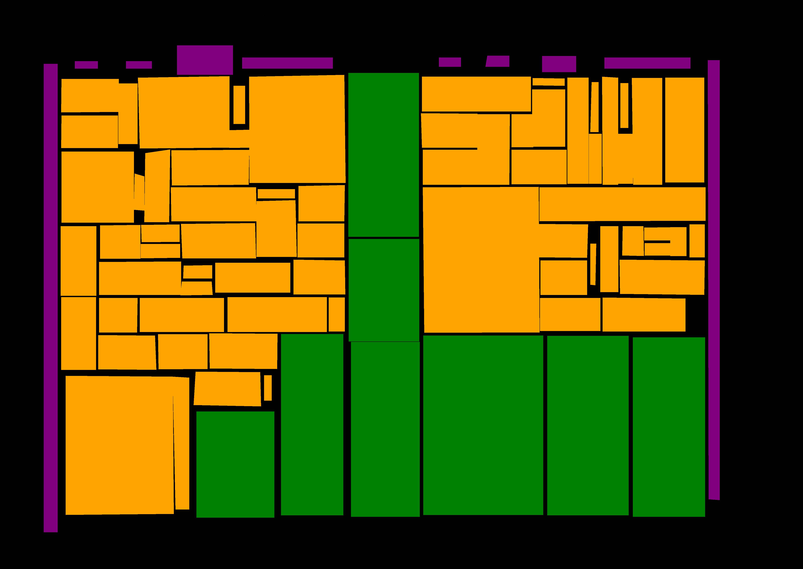
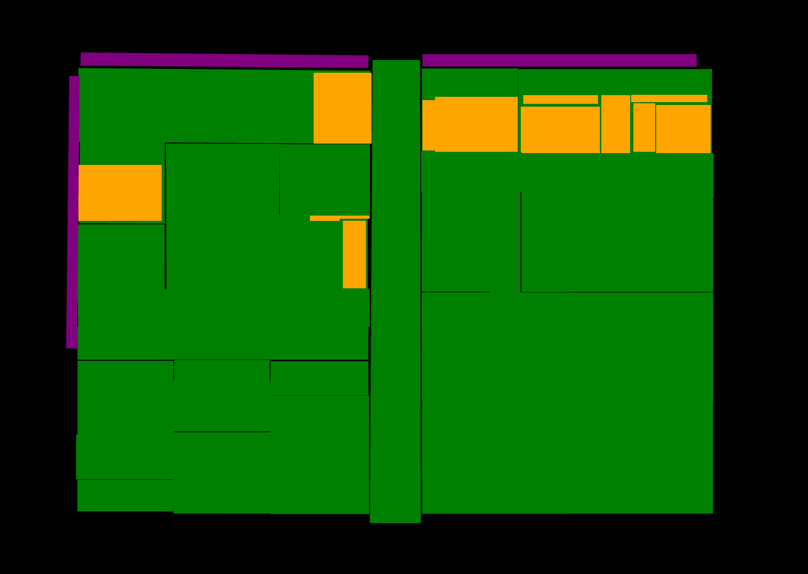
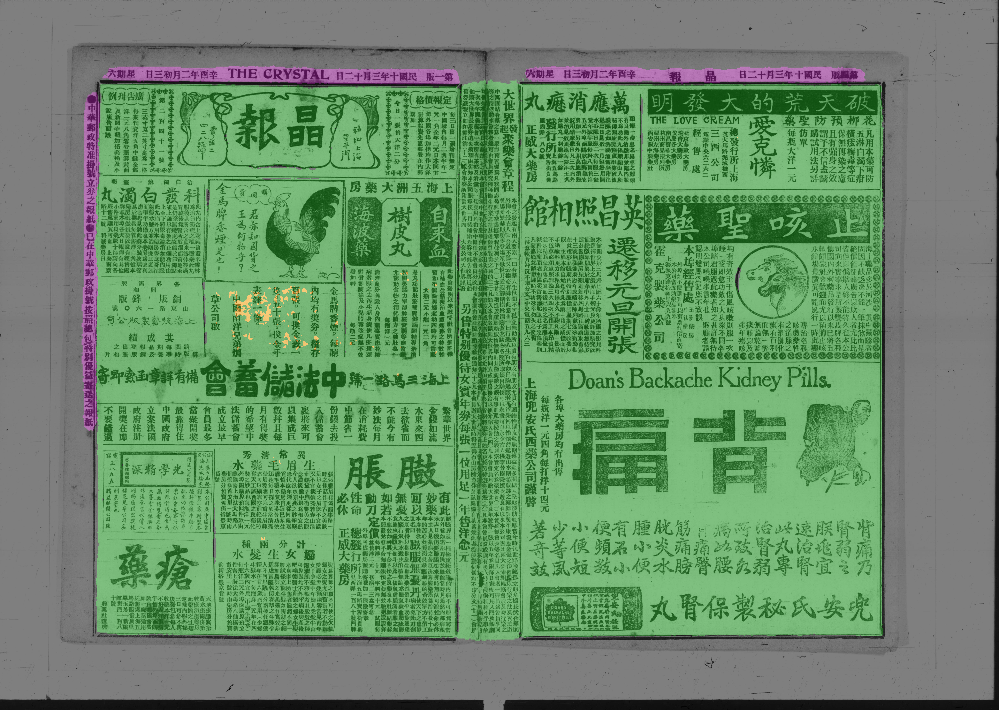
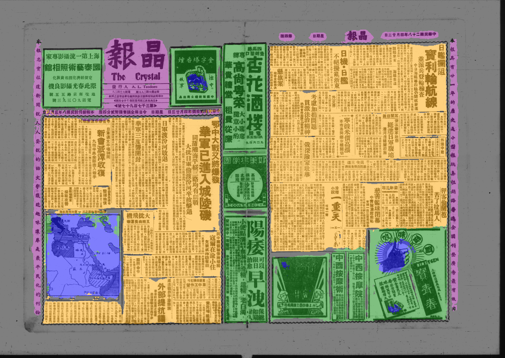

# Detection of all Four Content Types

This experiment tests multi-class classification with all four labels (article,
advertisement, additional, image). All commands below are supposed to be
executed from the directory this report resides in.

## Getting Annotation Masks

Downloading annotations into `annotations/masks/` and linking the corresponding images into `annotations/images/`.

```
python3 -m ecpo_segment.get_annotations --max-annotations 20000 Jingbao/images_renamed --out-top-dir annotations/masks --link-image-dir annotations/images
```

Splitting the annotations into train dev and test set, which will reside in `data/`. By default, train will take 80 percent of the images, the other two splits 10 percent each. This can be changed in the script `make_splits.sh`.

```
bash ../../make_splits.sh annotations/masks annotations/images data/
```

## Training

Using scripts in the `dhSegment` repository to download a pretrained ResNet model and to fine-tune it on our data:

```
python3 /path/to/dhSegment/pretrained_models/download_resnet_pretrained_model.py
python3 /path/to/dhSegment/pretrained_models/train.py with config.json
```

According to `config.json`, this will place the model in `model/export/`

## Inference

Using the trained model (you need to adjust the model directory) to make
predictions on the test set and saving them in `predictions/test/`:

```
python3 -m ecpo_segment.predict --model-dir model/export/1578932914 data/test/images predictions/test
```

This will put the produced masks in `predictions/test/raw` and overlay them on
the original images for easier qualitative evaluation placing the overlays in
`predictions/test/raw_overlays`.

## Quantitative Evaluation

Calculating the Intersection over Union (IoU) of the predictions on the test
set:

```
python3 -m ecpo_segment.evaluate predictions/test/raw data/test/labels classes.txt
```

Result:

| Class         |   IoU |
| ------------- | ----: |
| Background    | 0.891 |
| Article       | 0.608 |
| Image         | 0.334 |
| Advertisement | 0.811 |
| Additional    | 0.740 |

Mean of the IoUs: 0.677

## Qualitative Evaluation

In this section, we look at some selected predictions to see how the system
does. The first of the two images is always the ground truth annotation, the
second is the prediction.

### Good Performance on Simple Layouts






### Good Performance on Clearly Separated Mixed Layouts




### Difficulty on Subtly Mixed Layouts




### Acceptable Performance for Detecting Even Small Images



